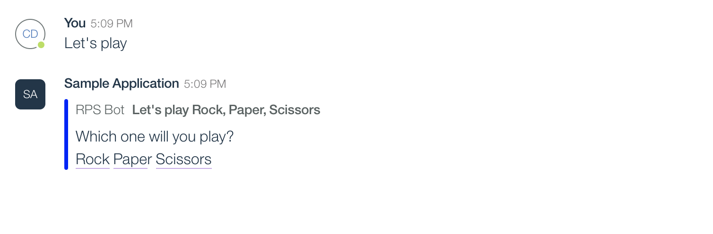

# Watson Workspace Python Sample App

## Setup
This is a basic [Watson Workspace](https://help.workspace.ibm.com/hc/en-us/articles/230038427-What-is-Watson-Workspace-) bot that reacts to messages and user events using [this repo](https://github.com/cathaldi/watson-workspace-python-sdk).
The application is deployed on IBM's Cloudfoundary service.

To get this demo up and running you will need an IBM Account.
- Create a free [Cloud Foundary python app ](https://cloud.ibm.com/catalog/starters/python) that is **hosted in Dallas**
- Git clone this repo and push to cloud foundary  ( Instructions under the Getting Started section of the CF App )
- Create a [Watson workspace App](https://developer.watsonwork.ibm.com). Instructions can be found [here](https://watson-workspace-python-sdk.readthedocs.io/en/latest/making_a_bot.html).
- Create a Listener for create-messages and create-annotation using the IBM cloud app url with '/workspace/messages' anf /workspace/annotations' respectfully. [Instructions found here](https://watson-workspace-python-sdk.readthedocs.io/en/latest/webhooks.html)
- Update environment variables in the Python app ( Under Runtime -> Environment Variables )

App should be hosted in Dallas to ensure the webhook receives a response in under 2 seconds.
If it does not receive a response in that timeframe it will replay the event until a a response is received
in under 2 seconds.

From the creation of the app and listeners the following environment variables can be set.
- APP_ID
- APP_SECRET
- MESSAGES_WEBHOOK_SECRET
- ANNOTATIONS_WEBHOOK_SECRET

## Files in this repo

- mannifest.yml: Tells Cloudfoundary container information for application

- Procfile : Tells Cloudfoundary how to start the application

- runtime.txt : Tells Cloudfoundary which runetime version to use, this project is using the latest python version which
is 3.6.4

- requirements.txt : Our python dependancies

- app.py : Our python webserver

## Application

The Application is meant to demo
 - Webhooks : Message Created, Annotation Created
 - Sending Messages : Sending a response back to the Workspace that triggered the event
 - Using Actions in a Workspace : Handling Basic /slash commands
 - Using Action Fulfillment: Underlining text 
 
 ## Feature Examples
 
 ### Sending Messages & adding Focus Annotations
 
 
 Focus annotations allow us to underline text by phrases used in the text or by specifying the start and end position
 of the text. When adding an annotation we also specify an action to be called when it's clicked. In the above example we selected Paper.
 
    workspace_message = Message.create(space_id=json_payload.get("spaceId"),title="Let's play Rock, Paper, Scissors",
                                       text="Which one will you play? \\nRock Paper Scissors",actor="RPS Bot", color="blue")
    workspace_message.add_focus(start=26, end=30, actions='"/RPS Rock"')
    workspace_message.add_focus(start=31, end=35, actions='"/RPS Paper"')
    workspace_message.add_focus(start=37, end=45, actions='"/RPS Scissors"')

 ---
                                     
 ### Acition Fulfillment
 
 
 An Annotations Webhook event is fired and handled by the application
 For action fulfillment we need to get the Dialogue id from the webhook event.
 
 The result is a pop up at the bottom with a suggested action. Once the pop up is clicked the action will be executed.
 You'll see the annotation itself will have the option of the focus annotation clicked. So in the image above by clicking on the Rock 
 focus annotation we are shown the /RPS Rock pop up.
 
    webhook_event = Webhook.from_json(request.json)
    
    .
    .
    .

    response_annotaiton = Annotation("Rock Scissors Paper", "You rolled " + human_roll +
                                     "\\nI rolled " + "Scissors" + "\\n" + result)
    Message.message_with_annotation(conversation_id=webhook_event.space_id,
                                    target_dialog_id=webhook_event.annotation.get("targetDialogId"),
                                    target_user_id=webhook_event.user_id, annotation=response_annotaiton)

    ---
 
 ### Attachments
  
  
  Attachments are similar to Annotations but we can display a few attachments at once, each with a title, subtitle,
  body and buttons.
  Similar to Annotations, buttons can be used to trigger over events and annotations,
  
      deck = []
      card_list = ["Ace", "King", "Queen", "Jack", "Ten", "Nine", "Eight", "Seven", "Six", "Five", "Four",
                   "Three", "Two", "One"]
      for playing_card in card_list:  # make a Watson Workspace Annotation with 12 attachments
          workspace_card = Card(playing_card, "", "Hearts")
          workspace_card.add_button("This one", "/Cards " + playing_card.lower())
          deck.append(workspace_card)
 
      Message.message_with_attachment(conversation_id=webhook_event.space_id,
                                      target_dialog_id=webhook_event.annotation.get("targetDialogId"),
                                      target_user_id=webhook_event.user_id,
                                      cards=deck)
 ---
 
 ### Slash Commands
 
 
 As Slash commands were specifically set up we can interact with the application.
 They are added through the Watson Workspace App view, under Actions.
 
 ---